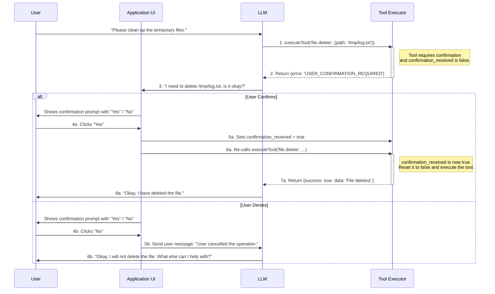
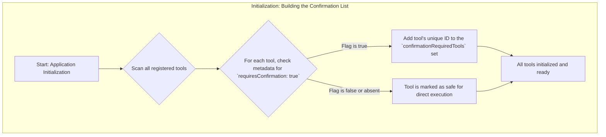
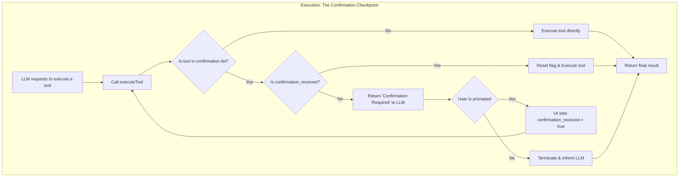

# Human-in-the-Loop (HITL) for Secure AI Tool Execution

## What is This?

Imagine your AI assistant wants to delete files, modify databases, or make expensive API calls. Without proper safeguards, the AI might accidentally cause damage while trying to help you.

**Human-in-the-Loop (HITL)** is like having a "Are you sure?" dialog box for dangerous AI actions. It ensures that potentially risky operations require your explicit permission before they happen.

## Why Do We Need This?

### The Problem

AI assistants are powerful but not perfect. They might:

- Misunderstand your request and delete the wrong files
- Modify important data by mistake
- Trigger costly operations you didn't intend
- Perform actions that can't be easily undone

### The Solution

HITL acts as a safety net by:

- ✅ **Pausing before dangerous actions** - Giving you time to review what's about to happen
- ✅ **Putting you in control** - You decide if the AI should proceed or stop
- ✅ **Building trust** - You know the AI won't surprise you with risky actions
- ✅ **Creating accountability** - Clear record of what you approved

## How It Works

Think of it like a two-step process:

### Step 1: The AI Asks Permission

When the AI wants to do something potentially risky:

1. It stops and asks you first
2. It explains exactly what it wants to do
3. It waits for your response

### Step 2: You Decide

You get to choose:

- **"Yes, go ahead"** - The AI proceeds with the action
- **"No, don't do that"** - The AI stops and asks what you'd like to do instead

## Step-by-Step Example: Deleting a File Safely

Let's trace exactly what happens when you ask the AI to delete a file:

### The Complete Interaction Flow



## What Makes a Tool "Risky"?

Tools are flagged for confirmation when they:

- **Delete or modify files** (file operations)
- **Change databases** (data modifications)
- **Cost money** (paid API calls)
- **Can't be undone** (irreversible actions)
- **Access sensitive data** (privacy concerns)

## Technical Overview (For Developers)

### The Four Key Components

1. **Confirmation Flag** - Tools are marked as `requiresConfirmation: true`
2. **Smart Registry** - System tracks which tools need approval
3. **Execution Wrapper** - Intercepts risky tool calls
4. **Permission State** - Remembers your "yes" for exactly one operation

### Detailed Technical Workflow

The system works in two main phases:

#### Phase 1: Initialization (When App Starts)



#### Phase 2: Execution (Every Time AI Uses a Tool)



### Security Features

- **One-time permissions** - Each "yes" works for exactly one action
- **No permission reuse** - AI can't reuse old permissions for new actions
- **Clear audit trail** - Everything is logged for accountability
- **Fail-safe design** - System defaults to asking permission when in doubt

## Implementation Quick Start

### 1. Mark Risky Tools

```typescript
// Mark a tool as requiring confirmation
const deleteFileTool = {
  name: "deleteFile",
  description: "Deletes a file from the filesystem",
  requiresConfirmation: true, // ← This makes it safe!
};
```

### 2. Handle Permission Requests

```typescript
// When AI requests risky action
if (toolRequiresConfirmation && !userHasConfirmed) {
  // Show user a confirmation dialog
  showConfirmationDialog({
    action: "Delete file",
    details: "This will permanently delete 'important.txt'",
    onConfirm: () => executeToolSafely(),
    onCancel: () => tellAIUserSaidNo(),
  });
}
```

### 3. Execute Safely

```typescript
// Only execute after user confirms
function executeToolSafely() {
  setUserConfirmation(true); // Grant permission
  executeTool(); // Run the tool
  setUserConfirmation(false); // Reset permission immediately
}
```

## Best Practices

### For Users

- **Read the confirmation prompts carefully** - Understand what the AI wants to do
- **When in doubt, say no** - You can always try a different approach
- **Start small** - Test risky operations on non-critical data first

### For Developers

- **Mark tools conservatively** - If it might cause problems, require confirmation
- **Make prompts clear** - Users should understand exactly what will happen
- **Test the flow** - Ensure confirmations work smoothly in your UI
- **Log everything** - Keep records of what users approved

## Common Questions

**Q: Will this slow down my AI assistant?**
A: Only for risky operations. Safe actions (like answering questions) happen instantly.

**Q: Can I turn off confirmations for tools I trust?**
A: Yes, developers can adjust which tools require confirmation based on your needs.

**Q: What happens if I accidentally click "yes"?**
A: The permission is only used once, so the AI can't do additional risky actions without asking again.

**Q: Can the AI remember my preferences?**
A: Not automatically - each risky action requires fresh permission for maximum safety.

## Benefits Summary

| Without HITL                 | With HITL                   |
| ---------------------------- | --------------------------- |
| ❌ AI acts immediately       | ✅ AI asks permission first |
| ❌ Mistakes can be costly    | ✅ Mistakes are prevented   |
| ❌ User feels out of control | ✅ User stays in control    |
| ❌ Trust issues              | ✅ Trust is built           |
| ❌ No audit trail            | ✅ Clear accountability     |

## Getting Started

1. **Identify your risky tools** - What actions could cause problems?
2. **Implement confirmation flow** - Add the permission system
3. **Test thoroughly** - Make sure it works smoothly
4. **Train your users** - Help them understand the new safety features
5. **Monitor and improve** - Adjust based on real-world usage

Remember: HITL is about making AI assistance safer and more trustworthy, not about slowing it down. Users will appreciate having control over important decisions!
