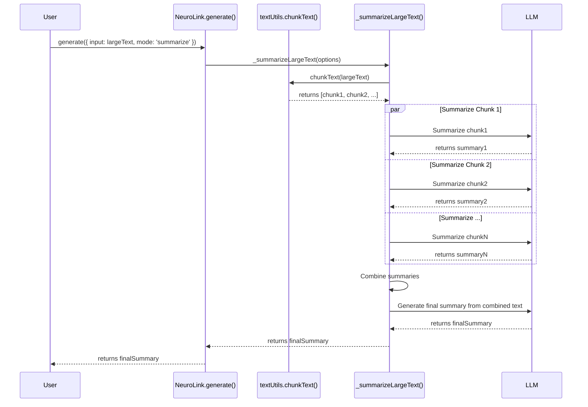

# Design Doc: Large Context Handling via Map-Reduce Summarization

## 1. Overview

This document outlines the design and implementation plan for adding large context handling capabilities to the `NeuroLink` SDK. The core of this proposal is a map-reduce summarization strategy to process text inputs that exceed the context window limits of underlying Large Language Models (LLMs).

## 2. Problem Statement

The `NeuroLink` SDK's `generate()` method currently sends the entire input prompt directly to the AI provider. This design fails when the input text is very large (e.g., a 1MB file), as it surpasses the model's maximum token limit, resulting in an API error and a complete failure of the operation.

The existing conversation summarization feature is designed for managing the history of a dialogue and does not address the challenge of processing a single, oversized document.

### Use Cases

This feature is critical for enabling new, high-value use cases, such as:

- **Document Summarization**: Summarizing large PDF, DOCX, or text files.
- **Data Analysis**: Analyzing long reports, transcripts, or logs to extract key insights.
- **Question Answering over Documents**: Allowing users to ask questions about a large document that is provided as context.

## 3. Challenges and Mitigations

### 3.1. Latency

- **Challenge**: Making multiple sequential calls to an LLM will significantly increase the total response time.
- **Mitigation**:
  1.  **Parallel Processing**: The "Map" step, where individual chunks are summarized, will be executed in parallel using `Promise.all`. This reduces the time for this step to the duration of the single longest-running chunk summarization, rather than the sum of all of them.
  2.  **Model Flexibility**: The system will be designed to allow for the use of faster, more cost-effective models (e.g., `gemini-2.5-flash`) for the intermediate chunk summarization, while a more powerful model can be used for the final, high-quality summary.

### 3.2. Context Loss Between Chunks

- **Challenge**: Splitting the text into independent chunks can cause the loss of context that spans across chunk boundaries.
- **Mitigation**:
  1.  **Chunk Overlap**: The chunking utility will support an `overlap` parameter. A portion of text from the end of one chunk will be included at the beginning of the next, ensuring a smoother contextual transition.
  2.  **Intelligent Splitting**: The utility will prioritize splitting text at natural boundaries like sentences (`.`, `!`, `?`) or paragraphs to keep related ideas together within a single chunk.

### 3.3. Cost

- **Challenge**: Multiple LLM calls will be more expensive than a single call.
- **Mitigation**: This is an inherent trade-off for gaining this new capability. The ability to use smaller, cheaper models for the initial chunking step will help manage costs effectively. The feature will be opt-in, so users only incur costs when they explicitly need to process large documents.

## 4. Proposed Solution & Architecture

We will implement a **Map-Reduce Summarization** workflow.

### High-Level Flow Diagram

```mermaid
graph TD
    A[Start: generate() called with large text] --> B{Text > Threshold?};
    B -->|No| C[Normal Generation Flow];
    B -->|Yes| D[Chunk Text into Pieces];
    D --> E[Map: Summarize Each Chunk in Parallel];
    E --> F[Reduce: Combine Chunk Summaries];
    F --> G[Generate Final Summary from Combined Text];
    G --> H[End: Return Final Summary];
    C --> H;
```

## 5. Detailed Design and Implementation

### 5.1. Sequence Diagram

This diagram shows the interaction between the different components of the system.



### 5.2. New Utility: `textUtils.ts`

A new file will be created at `src/lib/utils/textUtils.ts` to contain the logic for splitting large texts into manageable pieces.

#### Detailed Explanation of `chunkText`

This function is the foundation of our solution. It intelligently divides a large string into an array of smaller strings (`chunks`) based on a target size, while trying to maintain the contextual integrity of the original text.

```typescript
// src/lib/utils/textUtils.ts

// Defines the structure for a single piece of the divided text.
// `content` holds the text itself.
// `index` tracks the original position of the chunk.
export interface TextChunk {
  content: string;
  index: number;
}

// Defines the configuration for the chunking process.
// `chunkSize`: The target maximum size for each chunk in characters.
// `overlap`: How many characters from the end of one chunk to include at the start of the next. This is crucial for maintaining context across chunk boundaries.
export interface ChunkingOptions {
  chunkSize: number;
  overlap: number;
}

export function chunkText(text: string, options: ChunkingOptions): TextChunk[] {
  const { chunkSize, overlap } = options;
  // Early exit for empty or invalid input.
  if (!text || text.length === 0) {
    return [];
  }

  // If the text is already smaller than the desired chunk size, no chunking is needed.
  // It's returned as a single chunk.
  if (text.length <= chunkSize) {
    return [{ content: text, index: 0 }];
  }

  const chunks: TextChunk[] = [];
  let currentIndex = 0; // This pointer tracks our position in the original text.

  // Loop through the text until the entire string has been chunked.
  while (currentIndex < text.length) {
    // Get the remaining part of the text to be processed.
    const remainingText = text.substring(currentIndex);
    // Determine the maximum possible end point for the current chunk.
    let endIndex = Math.min(chunkSize, remainingText.length);

    // If the remaining text is small enough to be the final chunk, add it and exit.
    if (remainingText.length <= chunkSize) {
      chunks.push({ content: remainingText, index: chunks.length });
      break;
    }

    // --- Intelligent Splitting Logic ---
    // We try to find the best possible place to split the text to avoid breaking sentences.
    let splitPosition = -1;
    const potentialSplitArea = remainingText.substring(0, endIndex);

    // 1. Prioritize splitting at the end of a sentence.
    for (const boundary of [".", "!", "?"]) {
      const pos = potentialSplitArea.lastIndexOf(boundary);
      if (pos > splitPosition) {
        splitPosition = pos;
      }
    }

    // 2. If no sentence ending is found, try to split at a space.
    if (splitPosition === -1) {
      splitPosition = potentialSplitArea.lastIndexOf(" ");
    }

    // 3. If no space is found (e.g., a very long word or URL), split at the character limit.
    if (splitPosition === -1) {
      splitPosition = endIndex - 1;
    }

    // The actual end of the chunk is one character after the split point.
    endIndex = splitPosition + 1;

    // Create the chunk from the start of the remaining text to the calculated end point.
    const chunkContent = remainingText.substring(0, endIndex);
    chunks.push({ content: chunkContent, index: chunks.length });

    // Move the main pointer forward for the next iteration.
    // We subtract the `overlap` to ensure context is carried over to the next chunk.
    currentIndex += Math.max(1, endIndex - overlap);
  }

  return chunks;
}
```

### 5.3. New Workflow: `_summarizeLargeText()`

This new private method orchestrates the entire map-reduce workflow. It will be added to the `NeuroLink` class in `src/lib/neurolink.ts`.

#### Detailed Explanation of `_summarizeLargeText`

This function acts as the controller for the large context handling process. It chunks the text, manages the parallel summarization of each chunk, combines the results, and generates the final summary.

```typescript
// Inside the NeuroLink class in src/lib/neurolink.ts

private async _summarizeLargeText(options: GenerateOptions): Promise<GenerateResult> {
  // Destructure all necessary properties from the original options.
  const { input, largeTextHandling, provider, model } = options;
  const text = input.text;

  // --- Step 1: Chunk the Text ---
  // The large input text is passed to our utility function to be broken down.
  // We use the configuration provided in `largeTextHandling` or fall back to sensible defaults.
  const chunks = chunkText(text, {
    chunkSize: largeTextHandling?.chunkSize || 4000, // Default to 4000 characters per chunk.
    overlap: largeTextHandling?.overlap || 200,     // Default to 200 characters of overlap.
  });

  // --- Step 2: The "Map" Step ---
  // We process all chunks concurrently for maximum efficiency.
  // `Promise.all` sends all summarization requests to the LLM at the same time.
  const chunkSummaries = await Promise.all(
    // `chunks.map` creates an array of promises, one for each chunk.
    chunks.map(chunk => this.generate({
      // Each chunk is wrapped in a new prompt asking for a concise summary.
      input: { text: `Summarize the following text concisely: ${chunk.content}` },
      // Use a specific, fast model for this intermediate step to reduce latency and cost.
      // This can be configured by the user.
      provider: largeTextHandling?.chunkingProvider || provider,
      model: largeTextHandling?.chunkingModel || 'gemini-2.5-flash',
      // CRITICAL: This recursive call to `this.generate` must have large text handling
      // disabled to prevent an infinite loop.
      largeTextHandling: { mode: 'none' }
    }))
  );

  // --- Step 3: The "Reduce" Step ---
  // All the individual chunk summaries are collected and joined together.
  // A separator is used to clearly distinguish between the different summaries.
  const combinedSummaries = chunkSummaries.map(result => result.content).join('\n\n---\n\n');

  // This combined text of summaries is sent to the LLM for the final processing step.
  const finalSummaryResult = await this.generate({
    input: { text: `The following are summaries of sequential parts of a large document. Create a single, cohesive, and detailed final summary from them:\n\n${combinedSummaries}` },
    // For this final step, we use the powerful provider and model the user originally requested
    // to ensure the highest quality output.
    provider: provider,
    model: model,
    // Again, disable large text handling to prevent loops.
    largeTextHandling: { mode: 'none' }
  });

  // --- Step 4: Return the Final Result ---
  // The result from the final summarization is returned.
  // We enrich the metadata to indicate that large text processing was performed
  // and include how many chunks were created.
  return {
      ...finalSummaryResult,
      metadata: {
          ...finalSummaryResult.metadata,
          largeTextProcessed: true,
          chunks: chunks.length,
      }
  };
}
```

### 5.4. Integration into `generate()`

The main `generate()` method will be modified to delegate to the new workflow when appropriate.

```typescript
// Modified generate() method in src/lib/neurolink.ts

async generate(optionsOrPrompt: GenerateOptions | string): Promise<GenerateResult> {
  const options: GenerateOptions =
    typeof optionsOrPrompt === 'string'
      ? { input: { text: optionsOrPrompt } }
      : optionsOrPrompt;

  // New Logic: Check for large text handling
  const largeTextConfig = options.largeTextHandling;
  const textLength = options.input.text.length;
  // Use a default threshold, but allow it to be overridden
  const threshold = largeTextConfig?.chunkSize || 4000;

  if (largeTextConfig?.mode === 'summarize' && textLength > threshold) {
    return this._summarizeLargeText(options);
  }

  // ... existing generate() logic continues here for normal processing
}
```

## 6. Configuration and API Changes

The `GenerateOptions` interface in `src/lib/types/generateTypes.ts` will be updated.

```typescript
// src/lib/types/generateTypes.ts

export interface GenerateOptions {
  // ... existing options
  largeTextHandling?: {
    mode: "none" | "summarize";
    chunkSize?: number;
    overlap?: number;
    chunkingProvider?: AIProviderName;
    chunkingModel?: string;
  };
}
```

- **`mode`**: `'none'` (default) or `'summarize'`.
- **`chunkSize`**: Target size for each text chunk (in characters). Defaults to `4000`.
- **`overlap`**: Character overlap between chunks. Defaults to `200`.
- **`chunkingProvider` / `chunkingModel`**: Optional. Allows specifying a faster/cheaper model for the intermediate "Map" step, enhancing performance and cost-effectiveness.

## 7. Testing Strategy

1.  **Unit Tests (`src/test/textUtils.test.ts`)**:
    - Test `chunkText` with empty, short, and long strings.
    - Verify that `overlap` is handled correctly.
    - Ensure splitting prioritizes sentence boundaries.
2.  **Integration Tests (`src/test/largeContext.test.ts`)**:
    - Test the main `generate()` method with a string larger than the `chunkSize` threshold.
    - Mock the `_summarizeLargeText` method to confirm it's called when `mode` is `'summarize'`.
    - Mock the internal `generate` calls to verify the map-reduce logic is working as expected (i.e., multiple parallel calls followed by one final call).
    - Confirm that the normal workflow is used when `mode` is `'none'`.
3.  **End-to-End (E2E) Test (`examples/summarize-large-file.js`)**:
    - Create a script that reads a large text file from the disk.
    - Calls `neurolink.generate()` with the file content and `largeTextHandling: { mode: 'summarize' }`.
    - Prints the final summary to the console for manual validation of quality.
