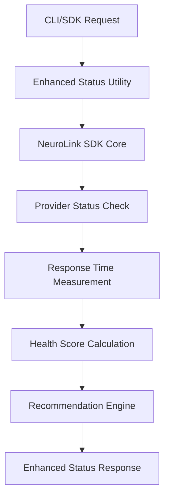

# Provider Status Monitoring and Health Management

> **Enterprise-Grade Provider Health Monitoring** - Real-time provider status, performance metrics, and intelligent recommendations for optimal AI development workflows.

## Overview

NeuroLink's Provider Status Monitoring system provides comprehensive health monitoring, performance analytics, and actionable recommendations for all AI providers in your configuration. This enterprise-grade feature ensures optimal provider selection, proactive issue detection, and seamless failover capabilities.

## Features

### 🏥 Real-Time Health Monitoring

- **Live Provider Status**: Real-time connectivity and authentication validation
- **Response Time Tracking**: Millisecond-precision performance monitoring
- **Configuration Validation**: Automatic detection of missing or invalid credentials
- **Availability Monitoring**: Continuous health checks with historical tracking

### 📊 Performance Analytics

- **Response Time Analysis**: Detailed latency metrics across providers
- **Health Scoring**: 0-100 health score calculation based on multiple factors
- **Cost Analysis**: Provider cost tiers and budget optimization recommendations
- **Capability Assessment**: Feature comparison across providers (streaming, vision, function-calling)

### 🎯 Intelligent Recommendations

- **Provider Optimization**: AI-powered recommendations for primary and fallback providers
- **Configuration Guidance**: Step-by-step setup instructions for unconfigured providers
- **Performance Insights**: Actionable suggestions for improving response times and reliability
- **Cost Optimization**: Smart recommendations for balancing cost and performance

## Implementation

### Core Components

The Provider Status system is built on three main components:

```typescript
// Enhanced Provider Status Utility
export async function getEnhancedProviderStatus(): Promise<EnhancedStatusResult>;

// Health Score Calculation
function calculateHealthScore(result: ProviderResult): number;

// Intelligent Recommendations
function generateRecommendations(results: ProviderResult[]): Recommendation[];
```

### Architecture Pattern



## Usage Examples

### CLI Usage

#### Basic Status Check

```bash
# Quick provider status overview
npx @juspay/neurolink generate "test" --provider google-ai

# JSON output for programmatic use
npx @juspay/neurolink generate "test" --provider google-ai --json
```

#### Advanced Monitoring

```bash
# Test MCP server connectivity
npx @juspay/neurolink mcp test

# Test specific MCP server
npx @juspay/neurolink mcp test filesystem
```

### SDK Integration

#### Basic Status Monitoring

```typescript
import { createAIProvider } from "@juspay/neurolink";

// Check provider status programmatically
async function checkProviderHealth() {
  const providers = ["google-ai", "openai", "anthropic"];

  for (const providerName of providers) {
    try {
      const provider = await createAIProvider(providerName);
      const result = await provider.generate({
        prompt: "test",
        maxTokens: 5,
      });

      console.log(
        `✅ ${providerName}: Working (${result.usage?.totalTokens} tokens)`,
      );
    } catch (err) {
      const message = err instanceof Error ? err.message : String(err);
      console.log(`❌ ${providerName}: ${message}`);
    }
  }
}

// Check via demo server API
const response = await fetch("http://localhost:9876/api/status");
const status = await response.json();

console.log(
  `✅ ${
    Object.keys(status.providers).filter((p) => status.providers[p].available)
      .length
  } providers available`,
);
console.log(`🎯 Best provider: ${status.bestProvider}`);
```

#### Real-Time Monitoring Dashboard

```typescript
import { createAIProvider } from "@juspay/neurolink";
import { EventEmitter } from "events";

class ProviderHealthMonitor extends EventEmitter {
  private providers: string[];
  private healthStatus: Map<string, any>;

  constructor() {
    super();
    this.providers = ["google-ai", "openai", "anthropic", "vertex"];
    this.healthStatus = new Map();
  }

  async startMonitoring(interval = 30000) {
    setInterval(async () => {
      const healthUpdate = await this.checkAllProviders();

      // Emit health events
      this.emit("healthUpdate", healthUpdate);

      // Alert on provider failures
      const failedProviders = Object.entries(healthUpdate)
        .filter(([_, status]) => !status.working)
        .map(([name, _]) => name);

      if (failedProviders.length > 0) {
        this.emit("healthAlert", {
          severity: "warning",
          providers: failedProviders,
          recommendations: this.generateRecommendations(healthUpdate),
        });
      }
    }, interval);
  }

  async checkAllProviders() {
    const results: Record<
      string,
      {
        working: boolean;
        responseTime?: number;
        error?: string;
        lastChecked: string;
      }
    > = {};

    for (const providerName of this.providers) {
      try {
        const provider = await createAIProvider(providerName);
        const startTime = Date.now();

        await provider.generate({
          prompt: "test",
          maxTokens: 5,
        });

        results[providerName] = {
          working: true,
          responseTime: Date.now() - startTime,
          lastChecked: new Date().toISOString(),
        };
      } catch (error) {
        results[providerName] = {
          working: false,
          error: error.message,
          lastChecked: new Date().toISOString(),
        };
      }
    }

    return results;
  }

  generateRecommendations(healthUpdate: any): string[] {
    const recommendations = [];
    const workingProviders = Object.values(healthUpdate).filter(
      (status: any) => status.working,
    );

    if (workingProviders.length === 0) {
      recommendations.push(
        "All providers are down. Check network connectivity and API credentials.",
      );
    } else if (workingProviders.length === 1) {
      recommendations.push(
        "Only one provider working. Consider configuring backup providers for reliability.",
      );
    }

    return recommendations;
  }
}

// Usage
const monitor = new ProviderHealthMonitor();
monitor.on("healthAlert", (alert) => {
  console.warn(`⚠️ Provider health issue: ${alert.providers.join(", ")}`);
  alert.recommendations.forEach((rec) => console.log(`💡 ${rec}`));
});

await monitor.startMonitoring();
```

## Status Response Structure

### Provider Status Result (from `/api/status`)

```typescript
interface ProviderStatusResult {
  timestamp: string;
  providers: Record<string, ProviderStatus>;
  bestProvider: string | null;
  configuration: {
    defaultProvider: string;
    streamingEnabled: boolean;
    fallbackEnabled: boolean;
  };
  // Added for parity with examples below
  summary: {
    availabilityRate: number;
    totalProviders: number;
    workingProviders: number;
  };
  insights: {
    fastestProvider?: string;
    slowestProvider?: string;
    averageResponseTime: number;
  };
  recommendations: Recommendation[];
}
```

### Provider Status Information

```typescript
interface ProviderStatus {
  configured: boolean;
  authenticated: boolean;
  available: boolean;
  // True when all checks (configured + authenticated + generation) pass
  working: boolean;
  model?: string;
  costTier?:
    | "free-tier"
    | "free-local"
    | "low"
    | "medium"
    | "premium"
    | "enterprise"
    | "variable"
    | "custom";
  error?: string;
}
```

### Enhanced Status Result

```typescript
interface EnhancedStatusResult {
  timestamp: string;
  providers: Record<string, ProviderStatus>;
  bestProvider: string | null;
  summary: {
    availabilityRate: number;
    totalProviders: number;
    workingProviders: number;
  };
  insights: {
    fastestProvider: string | null;
    slowestProvider: string | null;
    averageResponseTime: number;
  };
  recommendations: Recommendation[];
  configuration: {
    defaultProvider: string;
    streamingEnabled: boolean;
    fallbackEnabled: boolean;
  };
}

interface Recommendation {
  type: "critical" | "warning" | "info" | "success";
  category: "configuration" | "reliability" | "performance" | "cost" | "setup";
  message: string;
  action: string;
}
```

## Provider Status Classification

The system evaluates providers based on their actual runtime status:

### Status Categories

- **Configured**: Provider has required environment variables set
- **Authenticated**: Provider successfully validates API credentials
- **Available**: Provider responds to test generation requests
- **Working**: All checks pass - ready for production use

### Status Determination Process

1. **Environment Check**: Verify required API keys and configuration
2. **Authentication Test**: Validate credentials with minimal API call
3. **Generation Test**: Confirm provider can generate content
4. **Best Provider Selection**: Choose first working provider from priority list

## Provider Cost Tiers

Understanding provider cost structures helps optimize your AI spending:

### Cost Tier Classification

- **Free Tier**: `google-ai`, `huggingface` - No cost for basic usage
- **Free Local**: `ollama` - Local processing, no API costs
- **Low Cost**: `vertex`, `mistral` - Competitive pricing for production use
- **Medium Cost**: `bedrock`, `anthropic` - Balanced features and pricing
- **Premium**: `openai` - Advanced capabilities, higher cost
- **Enterprise**: `azure` - Enterprise features and compliance
- **Variable**: `litellm` - Cost depends on underlying provider
- **Custom**: `sagemaker` - Custom model hosting costs

## Intelligent Recommendations

The recommendation engine provides actionable guidance based on your current configuration:

### Configuration Recommendations

```typescript
// Critical: No providers configured
{
  type: 'critical',
  category: 'configuration',
  message: 'No providers configured. Set up at least one provider to use NeuroLink.',
  action: 'Configure GOOGLE_AI_API_KEY for free tier access'
}

// Warning: Single point of failure
{
  type: 'warning',
  category: 'reliability',
  message: 'Only one provider configured. Add backup providers for better reliability.',
  action: 'Configure additional providers like OpenAI or Anthropic'
}
```

### Performance Recommendations

```typescript
// Info: Slow response times
{
  type: 'info',
  category: 'performance',
  message: 'Slow response times detected: vertex, bedrock',
  action: 'Consider using faster providers for time-sensitive applications'
}
```

### Cost Optimization

```typescript
// Info: No free tier providers
{
  type: 'info',
  category: 'cost',
  message: 'No free-tier providers configured.',
  action: 'Consider adding Google AI Studio (free tier) for development'
}
```

### Success Acknowledgment

```typescript
// Success: Good configuration
{
  type: 'success',
  category: 'setup',
  message: 'Excellent! 3 providers working correctly.',
  action: 'Your setup provides good reliability and fallback options'
}
```

## Provider Selection Intelligence

### Primary Provider Selection

The system intelligently recommends primary providers based on:

1. **Priority Order**: `['google-ai', 'openai', 'anthropic', 'vertex', 'mistral']`
2. **Performance Metrics**: Response time and reliability
3. **Availability**: Current working status
4. **Use Case Suitability**: Feature compatibility

### Fallback Provider Selection

Fallback providers are chosen for maximum diversity:

1. **Different Provider Types**: Avoid single points of failure
2. **Geographic Diversity**: Different infrastructure providers
3. **Capability Overlap**: Ensure feature compatibility
4. **Performance Balance**: Maintain acceptable response times

## Error Handling and Recovery

### Common Error Scenarios

- **Authentication Failures**: Invalid API keys or expired tokens
- **Network Issues**: Connectivity problems or timeouts
- **Service Outages**: Provider-side service disruptions
- **Configuration Errors**: Missing environment variables or invalid settings

### Automatic Recovery

The system provides automatic recovery mechanisms:

```typescript
// Graceful degradation with fallback
if (!primaryProvider.working) {
  console.log(
    `Primary provider ${primaryProvider.name} failed, switching to ${fallbackProvider.name}`,
  );
  return await fallbackProvider.generate(prompt);
}
```

## Best Practices

### 1. Multi-Provider Setup

```bash
# Configure multiple providers for reliability
export GOOGLE_AI_API_KEY="your-google-api-key"
export OPENAI_API_KEY="your-openai-api-key"
export ANTHROPIC_API_KEY="your-anthropic-api-key"
```

### 2. Regular Health Monitoring

```typescript
// Set up periodic health checks
setInterval(async () => {
  const status = await getEnhancedProviderStatus();

  if (status.summary.availabilityRate < 80) {
    // Alert operations team
    notifyOpsTeam(status.recommendations);
  }
}, 300000); // Every 5 minutes
```

### 3. Performance Optimization

```typescript
// Use fastest providers for time-sensitive tasks
const status = await getEnhancedProviderStatus();
const fastestProvider = status.insights.fastestProvider;

if (isTimeSensitive && fastestProvider) {
  return await neurolink.generate(prompt, { provider: fastestProvider });
}
```

### 4. Cost Management

```typescript
// Prefer free-tier providers for development
const status = await getEnhancedProviderStatus();
const freeTierProviders = Object.entries(status.providers)
  .filter(([_, info]) => info.costTier === "Free Tier")
  .map(([name, _]) => name);

if (isDevelopment && freeTierProviders.length > 0) {
  return await neurolink.generate(prompt, { provider: freeTierProviders[0] });
}
```

## Integration with CI/CD

### Health Check in CI Pipeline

```yaml
# .github/workflows/health-check.yml
name: Provider Health Check
on:
  schedule:
    - cron: "0 */6 * * *" # Every 6 hours

jobs:
  health-check:
    runs-on: ubuntu-latest
    steps:
      - uses: actions/checkout@v4
      - run: npm install -g @juspay/neurolink
      - run: npx @juspay/neurolink status --json > health-report.json
      - name: Check Provider Status
        run: |
          # Count truly available/working providers
          WORKING_PROVIDERS=$(node -e "const status = JSON.parse(require('fs').readFileSync('health-report.json')); const working = Object.values(status.providers || {}).filter(p => (p && (p.working === true || p.available === true || p.status === 'working'))).length; console.log(working)")
          if [ "$WORKING_PROVIDERS" -lt 2 ]; then
            echo "❌ Insufficient available/working providers: ${WORKING_PROVIDERS}"
            exit 1
          else
            echo "✅ Provider health good: ${WORKING_PROVIDERS} providers available/working"
          fi
```

### Deployment Health Gates

```typescript
// deployment-health-check.js
import { createAIProvider } from "@juspay/neurolink";

async function validateDeployment() {
  const providers = ["google-ai", "openai", "anthropic"];
  const workingProviders = [];

  for (const providerName of providers) {
    try {
      const provider = await createAIProvider(providerName);
      await provider.generate({ prompt: "test", maxTokens: 5 });
      workingProviders.push(providerName);
    } catch (error) {
      console.warn(`Provider ${providerName} not available: ${error.message}`);
    }
  }

  // Require at least 2 working providers
  if (workingProviders.length < 2) {
    throw new Error(
      `Insufficient providers: ${workingProviders.length}/2 required`,
    );
  }

  console.log(
    `✅ Deployment validation passed: ${workingProviders.join(", ")} working`,
  );
  return { workingProviders, totalTested: providers.length };
}

// Use in deployment pipeline
await validateDeployment();
```

## Monitoring and Alerting

### Prometheus Metrics

```typescript
// metrics-collector.js
import { register, Gauge, Histogram } from "prom-client";
import { createAIProvider } from "@juspay/neurolink";

const providerStatusGauge = new Gauge({
  name: "neurolink_provider_status",
  help: "Provider status (1=working, 0=failed)",
  labelNames: ["provider"],
});

const responseTimeHistogram = new Histogram({
  name: "neurolink_provider_response_time_ms",
  help: "Provider response time in milliseconds",
  labelNames: ["provider"],
  buckets: [100, 500, 1000, 2000, 5000, 10000],
});

async function collectMetrics() {
  const providers = ["google-ai", "openai", "anthropic"];

  for (const providerName of providers) {
    try {
      const provider = await createAIProvider(providerName);
      const startTime = Date.now();

      await provider.generate({ prompt: "test", maxTokens: 5 });

      const responseTime = Date.now() - startTime;

      providerStatusGauge.set({ provider: providerName }, 1);
      responseTimeHistogram.observe({ provider: providerName }, responseTime);
    } catch (error) {
      providerStatusGauge.set({ provider: providerName }, 0);
    }
  }
}

// Collect metrics every minute
setInterval(collectMetrics, 60000);

// Expose metrics via HTTP endpoint
import express from "express";

const app = express();
app.get("/metrics", async (_req, res) => {
  res.set("Content-Type", register.contentType);
  res.end(await register.metrics());
});

app.listen(9100, () => console.log("Metrics server running on :9100"));
```

### Grafana Dashboard

```json
{
  "dashboard": {
    "title": "NeuroLink Provider Health",
    "panels": [
      {
        "title": "Provider Status",
        "type": "stat",
        "targets": [
          {
            "expr": "neurolink_provider_status",
            "legendFormat": "{{provider}}"
          }
        ]
      },
      {
        "title": "Response Time Distribution",
        "type": "heatmap",
        "targets": [
          {
            "expr": "rate(neurolink_provider_response_time_ms_bucket[5m])",
            "legendFormat": "{{provider}}"
          }
        ]
      }
    ]
  }
}
```

## Advanced Use Cases

### Load Balancing Based on Provider Status

```typescript
import { createAIProvider } from "@juspay/neurolink";

class StatusAwareLoadBalancer {
  private providers: string[];
  private statusCache: Map<string, any>;
  private lastUpdate: number;
  private CACHE_TTL: number;
  private _rrIndex: number;

  constructor() {
    this.providers = ["google-ai", "openai", "anthropic", "vertex"];
    this.statusCache = new Map();
    this.lastUpdate = 0;
    this.CACHE_TTL = 60000; // 1 minute
    this._rrIndex = 0;
  }

  async getWorkingProvider() {
    // Update status cache if needed
    if (Date.now() - this.lastUpdate > this.CACHE_TTL) {
      await this.updateStatusCache();
    }

    // Get providers that are currently working
    const workingProviders = Array.from(this.statusCache.entries())
      .filter(([_, status]) => status.working)
      .map(([name, _]) => name);

    if (workingProviders.length === 0) {
      throw new Error("No working providers available");
    }

    // Round-robin selection using _rrIndex
    const selectedProvider =
      workingProviders[this._rrIndex % workingProviders.length];
    this._rrIndex = (this._rrIndex + 1) % workingProviders.length;

    return selectedProvider;
  }

  async updateStatusCache() {
    this.statusCache.clear();

    for (const providerName of this.providers) {
      try {
        const provider = await createAIProvider(providerName);
        const startTime = Date.now();

        await provider.generate({ prompt: "test", maxTokens: 5 });

        this.statusCache.set(providerName, {
          working: true,
          responseTime: Date.now() - startTime,
          lastChecked: Date.now(),
        });
      } catch (error) {
        this.statusCache.set(providerName, {
          working: false,
          error: error.message,
          lastChecked: Date.now(),
        });
      }
    }

    this.lastUpdate = Date.now();
  }
}

// Usage
const loadBalancer = new StatusAwareLoadBalancer();
const workingProvider = await loadBalancer.getWorkingProvider();
```

### Circuit Breaker Pattern

```typescript
class ProviderCircuitBreaker {
  private failureCount = 0;
  private lastFailureTime = 0;
  private state: "CLOSED" | "OPEN" | "HALF_OPEN" = "CLOSED";

  constructor(
    private providerName: string,
    private failureThreshold = 5,
    private recoveryTimeout = 60000,
  ) {}

  async execute<T>(operation: () => Promise<T>): Promise<T> {
    if (this.state === "OPEN") {
      if (Date.now() - this.lastFailureTime > this.recoveryTimeout) {
        this.state = "HALF_OPEN";
      } else {
        throw new Error(`Circuit breaker OPEN for ${this.providerName}`);
      }
    }

    try {
      const result = await operation();

      if (this.state === "HALF_OPEN") {
        this.state = "CLOSED";
        this.failureCount = 0;
      }

      return result;
    } catch (error) {
      this.failureCount++;
      this.lastFailureTime = Date.now();

      if (this.failureCount >= this.failureThreshold) {
        this.state = "OPEN";
      }

      throw error;
    }
  }
}
```

## Troubleshooting

### Common Issues

#### 1. No Providers Available

```bash
# Diagnosis
npx @juspay/neurolink status --json

# Typical output showing configuration issues
{
  "timestamp": "2025-08-18T...",
  "providers": {
    "google-ai": {
      "available": false,
      "configured": false,
      "authenticated": false,
      "error": "Missing required environment variables: GOOGLE_AI_API_KEY"
    },
    "openai": {
      "available": false,
      "configured": false,
      "authenticated": false,
      "error": "Missing required environment variables: OPENAI_API_KEY"
    }
  },
  "bestProvider": null
}
```

**Solution**: Set up the required environment variables for at least one provider.

#### 2. Slow Response Times

```bash
# Check provider performance using benchmark
npx @juspay/neurolink benchmark

# Example output
{
  "timestamp": "2025-08-18T...",
  "prompt": "Write a haiku about artificial intelligence.",
  "results": {
    "google-ai": {
      "success": true,
      "responseTime": 1200,
      "model": "gemini-2.5-pro"
    },
    "vertex": {
      "success": true,
      "responseTime": 3400,
      "model": "gemini-2.5-pro"
    }
  }
}
```

**Solution**: Use the faster providers (like google-ai in this example) for time-sensitive applications.

#### 3. Authentication Failures

```bash
# Check specific provider status
npx @juspay/neurolink status --json

# Example authentication error
{
  "providers": {
    "openai": {
      "available": false,
      "configured": true,
      "authenticated": false,
      "error": "Invalid API key provided"
    }
  }
}
```

**Solution**: Verify and update the API key environment variable (OPENAI_API_KEY in this case).

### Debugging Commands

```bash
# Basic status check
npx @juspay/neurolink status

# JSON output for scripting
npx @juspay/neurolink status --json

# Performance benchmarking
npx @juspay/neurolink benchmark

# Test specific provider
GOOGLE_AI_API_KEY=your-key npx @juspay/neurolink status --json | jq '.providers."google-ai"'

# Check demo server status (if running)
curl http://localhost:9876/api/status
```

## Conclusion

NeuroLink's Provider Status Monitoring system provides enterprise-grade health management for AI provider infrastructure. With real-time monitoring, intelligent recommendations, and comprehensive analytics, it ensures optimal provider selection and proactive issue resolution.

Key benefits include:

- **Proactive Issue Detection**: Identify problems before they impact production
- **Intelligent Provider Selection**: Automatic optimization for performance and cost
- **Operational Excellence**: Complete visibility into AI infrastructure health
- **Developer Productivity**: Actionable recommendations reduce debugging time

This system transforms AI provider management from reactive troubleshooting to proactive optimization, ensuring reliable and efficient AI operations at enterprise scale.
