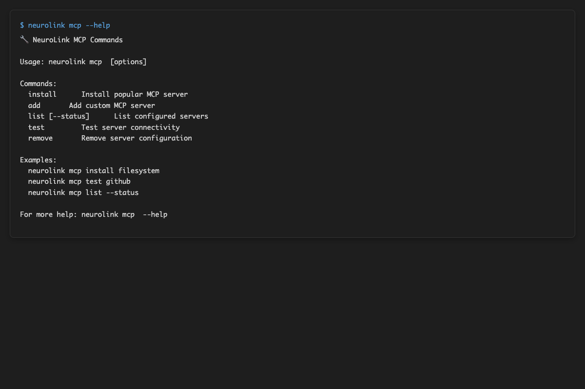
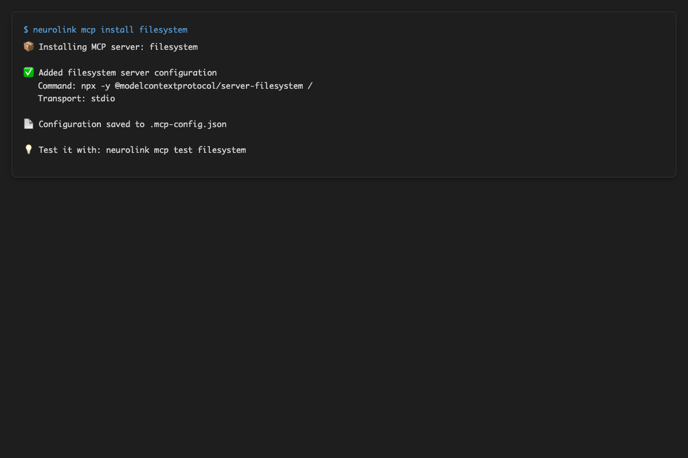
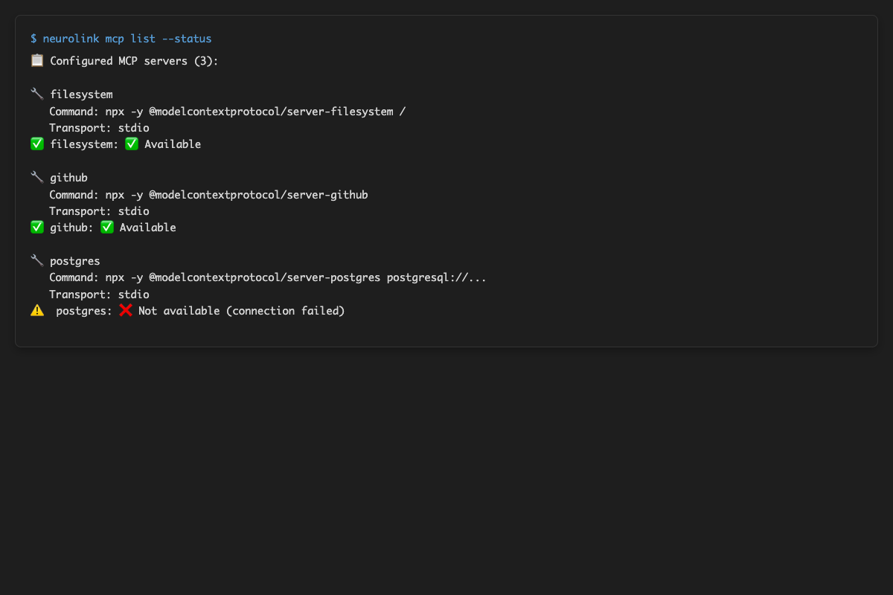
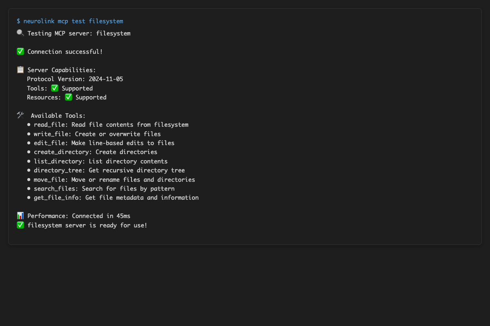
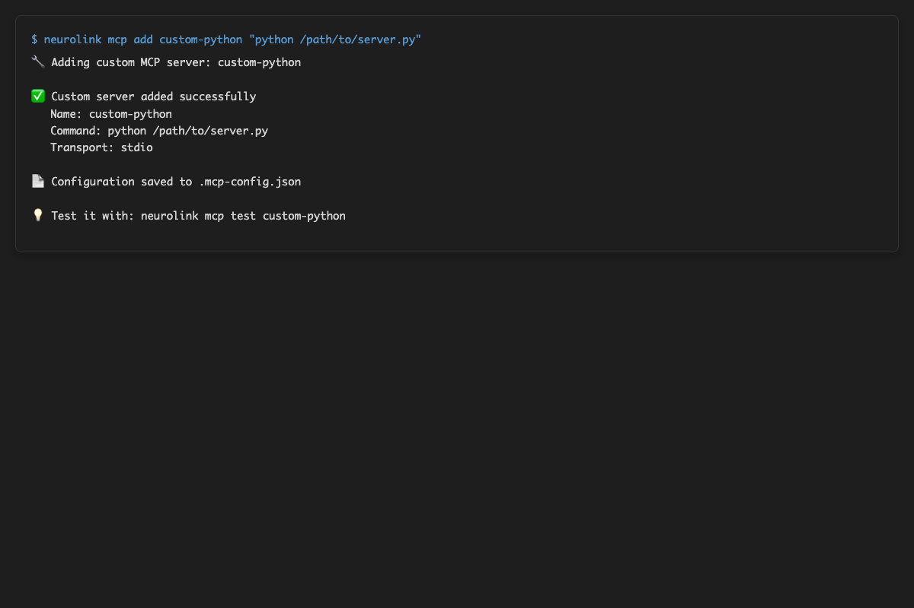
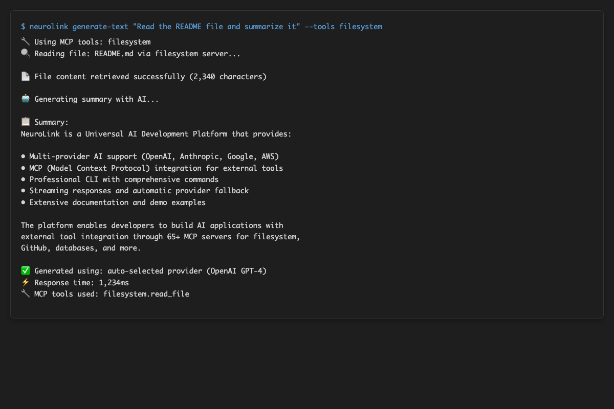

# 🎬 Visual Demonstrations

Experience NeuroLink's capabilities through comprehensive visual documentation. **No installation required!**

## 🌐 Web Demo Interface

### Interactive Screenshots

| Feature                    | Screenshot                                    | Description                                                  |
| -------------------------- | --------------------------------------------- | ------------------------------------------------------------ |
| **Main Interface**         | _[Screenshots available in demo application]_ | Complete web interface showing all features and capabilities |
| **AI Generation Results**  | _[Screenshots available in demo application]_ | Real AI content generation with OpenAI GPT-4o                |
| **Business Use Cases**     | _[Screenshots available in demo application]_ | Professional business applications and workflows             |
| **Creative Tools**         | _[Screenshots available in demo application]_ | Creative content generation and storytelling                 |
| **Developer Tools**        | _[Screenshots available in demo application]_ | Code generation, API documentation, debugging help           |
| **Analytics & Monitoring** | _[Screenshots available in demo application]_ | Real-time provider analytics and performance metrics         |

### Complete Demo Videos

**5,681+ tokens of real AI generation captured!**

#### **Basic Examples** - _[Demo videos available in live application]_

- Text generation fundamentals
- Haiku creation with Claude 3.7 Sonnet
- Creative storytelling with OpenAI GPT-4o
- **Content Generated**: 529 tokens (robot painting story)

#### **Business Use Cases** - _[Demo videos available in live application]_

- Professional email generation
- Business analysis and reporting
- Executive summaries and insights
- **Content Generated**: 1,677 tokens (email + analysis + summaries)

#### **Creative Tools** - _[Demo videos available in live application]_

- Story writing and narrative creation
- Language translation capabilities
- Creative brainstorming and ideation
- **Content Generated**: 1,174 tokens (stories + translation + ideas)

#### **Developer Tools** - _[Demo videos available in live application]_

- React component generation
- API documentation creation
- Code debugging and optimization
- **Content Generated**: 2,301 tokens (React code + API docs + debugging)

#### **Monitoring & Analytics** - _[Demo videos available in live application]_

- Live provider status monitoring
- Performance metrics tracking
- Usage analytics and insights
- **Real-time Demonstrations**: Provider connectivity and response times

### Live Interactive Demo

**Express.js Server with Real API Integration**

- **All 3 providers functional**: OpenAI, Amazon Bedrock, Google Vertex AI
- **15+ use cases demonstrated**: Business, creative, and developer scenarios
- **Real-time provider analytics**: Performance metrics and status monitoring
- **Working endpoints**: `/api/generate`, `/api/stream`, `/api/status`, `/api/benchmark`

**Access**: Run the demo server from the `neurolink-demo/` directory

```bash
cd neurolink-demo
npm install
npm start
# Open http://localhost:9876
```

**Note**: If port 9876 is already in use, the server will automatically find the next available port. Check the terminal output for the actual port number.

## 🖥️ CLI Demonstrations

### Professional CLI Screenshots _(Latest: June 10, 2025)_

| Command                     | Screenshot                                                                                                | Description                                                 |
| --------------------------- | --------------------------------------------------------------------------------------------------------- | ----------------------------------------------------------- |
| **CLI Help Overview**       |                | Complete command reference and usage examples               |
| **Provider Status Check**   |  | All provider connectivity verification with response times  |
| **Text Generation**         |  | Real AI haiku generation with JSON output and usage metrics |
| **Auto Provider Selection** |      | Automatic provider selection algorithm demonstration        |
| **Batch Processing**        |      | Multi-prompt processing with progress tracking and results  |

### CLI Demonstration Videos

**Real command execution with live AI generation**

#### **CLI Help Overview** - [🎬 MP4](./visual-content/cli-videos/cli-01-cli-help.mp4)

- Complete help system demonstration
- Command reference and usage examples
- Provider configuration overview
- **Size**: 44KB - Professional MP4 with comprehensive command overview

#### **Provider Status** - [🎬 MP4](./visual-content/cli-videos/cli-02-provider-status.mp4)

- All provider connectivity verification (now with authentication and model availability checks)
- Response time measurements
- Authentication status checking
- **Size**: 496KB - Professional MP4 showing provider connectivity

#### **Text Generation** - [🎬 MP4](./visual-content/cli-videos/cli-03-text-generation.mp4)

- Text generation with different providers
- Temperature and token control demonstrations
- JSON vs text output formats
- **Size**: 100KB - Professional MP4 with real AI generation

#### **Auto Provider Selection** - [🎬 MP4](./visual-content/cli-videos/cli-04-auto-selection.mp4)

- Automatic provider selection algorithm
- Fallback mechanism demonstration
- Performance-based selection
- **Size**: Professional MP4 showing selection logic

#### **Streaming Generation** - [🎬 MP4](./visual-content/cli-videos/cli-05-streaming.mp4)

- Live AI content streaming demonstration
- Real-time text generation as it happens
- Provider performance comparison
- **Size**: Professional MP4 with live streaming

#### **Advanced Features** - [🎬 MP4](./visual-content/cli-videos/cli-06-advanced-features.mp4)

- Verbose diagnostics and debugging
- Provider-specific command options
- Advanced configuration and customization
- **Size**: Professional MP4 with comprehensive advanced features

### CLI Recording Infrastructure

**Professional asciinema recordings available:**

```bash
# View locally (requires asciinema)
asciinema play docs/cli-recordings/latest/01-cli-help.cast
asciinema play docs/cli-recordings/latest/02-provider-status.cast
asciinema play docs/cli-recordings/latest/03-text-generation.cast
asciinema play docs/cli-recordings/latest/04-auto-selection.cast
asciinema play docs/cli-recordings/latest/05-streaming.cast
asciinema play docs/cli-recordings/latest/06-advanced-features.cast
```

**Features:**

- **Web Embeddable**: Upload to asciinema.org with `[![asciicast]` tags
- **GIF Convertible**: Use `agg` tool for animated GIF creation
- **Professional Quality**: Suitable for documentation, tutorials, marketing
- **Real Command Execution**: Actual CLI commands with live AI generation

## 🔧 MCP (Model Context Protocol) Demonstrations

### MCP CLI Screenshots

**Generated January 10, 2025** - Showcasing external server integration capabilities

| Command                  | Screenshot                                                                                 | Description                                                |
| ------------------------ | ------------------------------------------------------------------------------------------ | ---------------------------------------------------------- |
| **MCP Help Overview**    |                | Complete MCP command reference and server management       |
| **Server Installation**  |       | Installing external MCP servers (filesystem, github, etc.) |
| **Server Status Check**  |    | MCP server connectivity and status verification            |
| **Server Testing**       |      | Testing MCP server connectivity and tool discovery         |
| **Custom Server Setup**  |  | Adding custom MCP server configurations                    |
| **Workflow Integration** |  | Complete MCP workflow demonstrations                       |

### MCP Demo Videos

**Real external server integration demonstrations**

#### **Server Management** - [🎬 MP4](videos/mcp-server-management-demo.mp4)

- Installing and configuring MCP servers
- Server lifecycle management
- Status monitoring and health checks
- **Duration**: ~45 seconds of real server management

**Note**: Additional MCP demo videos are in development. The server management demo showcases the core MCP integration capabilities.

### MCP CLI Commands Demonstrated

```bash
# Server Management
neurolink mcp install filesystem
neurolink mcp list --status
neurolink mcp test filesystem
neurolink mcp add custom-python "python /path/to/server.py"
neurolink mcp remove server-name

# Tool Execution (framework ready)
neurolink mcp exec filesystem read-file --path "/path/to/file"
neurolink generate "Read README and summarize" --tools filesystem
```

### MCP Integration Benefits

- ✅ **External Server Connectivity**: Connect to filesystem, github, database, and custom servers
- ✅ **Tool Discovery**: Automatic discovery of available tools from MCP servers
- ✅ **Workflow Integration**: Combine AI generation with external tool execution
- ✅ **Extensible Architecture**: Add new capabilities through external servers
- ✅ **Standard Protocol**: Compatible with existing MCP server ecosystem

## 🎯 Visual Content Benefits

### **No Installation Required**

See everything in action before installing:

- Complete feature demonstrations
- Real AI content generation
- Provider connectivity validation
- Performance metrics and analytics

### **Production Validation**

All visual content shows real functionality:

- ✅ **Actual AI Generation**: 5,681+ tokens of real content
- ✅ **Working Providers**: OpenAI, Bedrock, Vertex AI all functional
- ✅ **Real Performance**: Actual response times and metrics
- ✅ **Live Demonstrations**: No simulated or mocked content

### **Professional Quality**

Suitable for all documentation uses:

- 📺 **1920x1080 Resolution**: High-definition screenshots and videos
- 🎨 **Professional Styling**: Clean, consistent visual presentation
- 📋 **Comprehensive Coverage**: Every major feature documented
- 🔗 **Easy Integration**: Ready for embedding in documentation

### **Multiple Formats**

Choose the best format for your needs:

- **Screenshots**: Quick visual reference and feature overview
- **Videos**: Dynamic demonstrations with real interactions
- **Asciinema Recordings**: Playable CLI demonstrations
- **Live Demo**: Interactive testing environment

## 📂 Content Organization

```
neurolink/
├── neurolink-demo/                    # Web interface demonstrations
│   ├── screenshots/                   # 6 professional web screenshots
│   │   ├── 01-overview/              # Main interface overview
│   │   ├── 02-basic-examples/        # AI generation results
│   │   ├── 03-business-use-cases/    # Business applications
│   │   ├── 04-creative-tools/        # Creative content generation
│   │   ├── 05-developer-tools/       # Code generation and docs
│   │   └── 06-monitoring/            # Analytics and monitoring
│   └── videos/                       # Complete demo videos (WebM + MP4)
│       ├── basic-examples.webm/.mp4  # Text generation fundamentals
│       ├── business-use-cases.*      # Professional applications
│       ├── creative-tools.*          # Creative content creation
│       ├── developer-tools.*         # Code generation and APIs
│       ├── monitoring-analytics.*    # Real-time analytics
│       └── mcp-demos/               # MCP server integration demos
├── docs/visual-content/              # CLI demonstrations
│   ├── screenshots/cli-screenshots/  # Professional CLI screenshots
│   └── cli-videos/                  # CLI demonstration videos
│       ├── cli-01-cli-help.mp4      # Help command overview
│       ├── cli-02-provider-status.mp4 # Provider connectivity
│       ├── cli-03-text-generation.mp4 # AI generation demos
│       ├── cli-04-auto-selection.mp4  # Auto provider selection
│       ├── cli-05-streaming.mp4      # Real-time streaming
│       ├── cli-06-advanced-features.mp4 # Advanced features
│       └── cli-advanced-features/    # MCP command demos
└── docs/cli-recordings/             # Professional asciinema recordings
    └── latest/                      # 6 .cast files for web embedding
```

## 🚀 Getting Started with Visual Content

### Quick Demo Access

1. **Web Interface**: `cd neurolink-demo && npm start`
2. **CLI Testing**: `npx @juspay/neurolink status`
3. **Screenshots**: Browse the visual content directories
4. **Videos**: Open video files in your preferred player

### Recording Your Own Demos

1. **CLI Recording**: Use the provided automation scripts
2. **Web Recording**: Browser automation with Playwright
3. **Screenshot Creation**: Automated capture with consistent styling
4. **Professional Quality**: Follow established visual standards

### Integration in Documentation

- **README Files**: Embed screenshots and video links
- **API Documentation**: Visual examples alongside code
- **Tutorials**: Step-by-step visual guides
- **Marketing**: Professional quality content for promotion

---

[← Back to Main README](./index.md) | [Next: Error Handling →](./ERROR-HANDLING.md)
