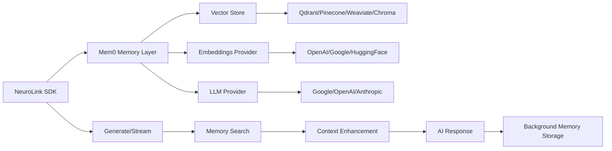

# Memory Integration with Mem0

Enhance your AI applications with persistent, context-aware memory using NeuroLink's integrated Mem0 support. This feature enables your AI to remember user preferences, context, and conversation history across sessions while maintaining perfect user isolation.

## 🎯 Overview

NeuroLink's Mem0 integration provides:

- **🧠 Cross-Session Memory**: AI remembers context across different conversations and sessions
- **👥 User Isolation**: Complete separation of memory contexts between different users
- **🔍 Semantic Search**: Vector-based memory retrieval using advanced embeddings
- **📦 Multiple Vector Stores**: Support for Qdrant, Pinecone, Weaviate, and Chroma
- **⚡ Streaming Integration**: Memory-enhanced real-time streaming responses
- **🔄 Background Processing**: Non-blocking memory operations that don't slow down responses
- **⚙️ Native Mem0 Config**: Direct support for Mem0's native configuration format

## 🏗️ Architecture



The memory system operates in three phases:
1. **Memory Retrieval**: Relevant memories are fetched before generating responses
2. **Context Enhancement**: Retrieved memories are seamlessly injected into prompts
3. **Memory Storage**: New conversation turns are stored asynchronously in the background

## 🚀 Quick Start

### Basic Configuration

```typescript
import { NeuroLink } from "@juspay/neurolink";

const neurolink = new NeuroLink({
  conversationMemory: {
    enabled: true,
    mem0Enabled: true,
    mem0Config: {
      // Mem0 native configuration format
      disableHistory: true,
      version: "v1.1",

      // Embeddings configuration
      embedder: {
        provider: "openai",
        config: {
          apiKey: process.env.OPENAI_API_KEY,
          model: "text-embedding-3-small", // 1536 dimensions
        },
      },

      // Vector store configuration
      vectorStore: {
        provider: "qdrant",
        config: {
          collectionName: "my_app_memories",
          dimension: 1536, // Must match embeddings model
          url: "http://localhost:6333",
          checkCompatibility: false,
        },
      },

      // LLM for memory processing
      llm: {
        provider: "google",
        config: {
          baseURL: "https://generativelanguage.googleapis.com",
          apiKey: process.env.GEMINI_API_KEY,
          model: "gemini-2.0-flash-exp"
        },
      }
    }
  },
  providers: {
    google: {
      apiKey: process.env.GEMINI_API_KEY
    }
  }
});
```

### First Conversation with Memory

```typescript
// Store user context
const response1 = await neurolink.generate({
  input: {
    text: "Hi! I'm Sarah, a frontend developer at TechCorp. I love React and TypeScript."
  },
  context: {
    userId: 'user_sarah_123',      // Required for memory isolation
    sessionId: 'onboarding_session' // Optional session identifier
  },
  provider: 'google-ai',
  model: 'gemini-2.0-flash-exp'
});

console.log(response1.content);
// AI acknowledges and stores Sarah's information

// Later conversation - memory retrieval
const response2 = await neurolink.generate({
  input: {
    text: "What programming languages do I work with? And remind me where I work?"
  },
  context: {
    userId: 'user_sarah_123',      // Same user ID
    sessionId: 'help_session'      // Different session
  },
  provider: 'google-ai'
});

console.log(response2.content);
// AI recalls: "You work with React and TypeScript at TechCorp"
```

## 📋 Configuration Options

### Vector Store Configurations

#### Qdrant (Recommended)

```typescript
vectorStore: {
  provider: "qdrant",
  config: {
    collectionName: "memories",
    dimension: 1536,
    url: "http://localhost:6333",
    // Optional: API key for Qdrant Cloud
    apiKey: process.env.QDRANT_API_KEY,
    checkCompatibility: false,
  },
}
```

#### Pinecone

```typescript
vectorStore: {
  provider: "pinecone",
  config: {
    index: "memory-index",
    namespace: "user-memories",
    apiKey: process.env.PINECONE_API_KEY,
    environment: "us-west1-gcp-free",
  },
}
```

#### Weaviate

```typescript
vectorStore: {
  provider: "weaviate",
  config: {
    url: "http://localhost:8080",
    className: "Memory",
    // Optional authentication
    apiKey: process.env.WEAVIATE_API_KEY,
  },
}
```

#### Chroma

```typescript
vectorStore: {
  provider: "chroma",
  config: {
    host: "localhost",
    port: 8000,
    collectionName: "memories",
    // Optional authentication
    auth: {
      type: "basic",
      credentials: process.env.CHROMA_AUTH
    }
  },
}
```

### Embedding Provider Options

#### OpenAI Embeddings (1536 dimensions)

```typescript
embedder: {
  provider: "openai",
  config: {
    apiKey: process.env.OPENAI_API_KEY,
    model: "text-embedding-3-small", // or text-embedding-3-large
  },
}
```

#### Google Embeddings (768 dimensions)

```typescript
embedder: {
  provider: "google",
  config: {
    apiKey: process.env.GOOGLE_AI_API_KEY,
    model: "text-embedding-004",
  },
}
```

#### HuggingFace Embeddings

```typescript
embedder: {
  provider: "huggingface",
  config: {
    apiKey: process.env.HUGGINGFACE_API_KEY,
    model: "sentence-transformers/all-MiniLM-L6-v2",
  },
}
```

### LLM Provider Options

The LLM is used by Mem0 for memory processing and organization:

#### Google AI

```typescript
llm: {
  provider: "google",
  config: {
    baseURL: "https://generativelanguage.googleapis.com",
    apiKey: process.env.GEMINI_API_KEY,
    model: "gemini-2.0-flash-exp"
  },
}
```

#### OpenAI

```typescript
llm: {
  provider: "openai",
  config: {
    apiKey: process.env.OPENAI_API_KEY,
    model: "gpt-4-turbo"
  },
}
```

#### Anthropic

```typescript
llm: {
  provider: "anthropic",
  config: {
    apiKey: process.env.ANTHROPIC_API_KEY,
    model: "claude-3-sonnet-20240229"
  },
}
```

## 💡 Advanced Usage Examples

### User Isolation in Multi-Tenant Applications

```typescript
// User Alice's conversation
const aliceResponse = await neurolink.generate({
  input: {
    text: "I prefer dark mode and use VSCode for development."
  },
  context: {
    userId: 'tenant_1_alice_123',
    sessionId: 'preferences_session'
  }
});

// User Bob's conversation (different tenant)
const bobResponse = await neurolink.generate({
  input: {
    text: "I love light themes and use WebStorm IDE."
  },
  context: {
    userId: 'tenant_2_bob_456',
    sessionId: 'setup_session'
  }
});

// Later: Alice queries her preferences
const aliceQuery = await neurolink.generate({
  input: {
    text: "What IDE do I use and what theme do I prefer?"
  },
  context: {
    userId: 'tenant_1_alice_123'
  }
});
// Returns: "You use VSCode with dark mode" (not Bob's preferences)
```

### Streaming with Memory Context

```typescript
// Memory-enhanced streaming
const stream = await neurolink.stream({
  input: {
    text: "Write me a personalized coding tutorial based on my experience level."
  },
  context: {
    userId: 'developer_sarah',
    sessionId: 'tutorial_session'
  },
  provider: 'anthropic',
  model: 'claude-3-sonnet-20240229',
  streaming: {
    enabled: true,
    enableProgress: true
  }
});

let fullContent = '';
for await (const chunk of stream.stream) {
  if (chunk.content) {
    fullContent += chunk.content;
    process.stdout.write(chunk.content);
  }
}

// The tutorial will be personalized based on Sarah's stored experience level,
// preferred technologies, and previous learning progress
```

## 🔄 Memory Lifecycle

### Automatic Memory Storage

Memory storage happens automatically after each conversation:

1. **Conversation Completion**: After AI generates a response
2. **Conversation Turn Creation**: User input + AI response are combined into a conversation turn
3. **Background Storage**: Memory is stored asynchronously using `setImmediate()` (non-blocking)
4. **Vector Embedding**: Text is converted to embeddings by Mem0
5. **Database Storage**: Stored in vector database with user context and metadata
6. **Indexing**: Made available for future searches

### Memory Storage Format

The actual storage format used by NeuroLink:

```typescript
// Conversation turn stored as JSON string
const conversationTurn = [
  { role: "user", content: "User's input text" },
  { role: "system", content: "AI's response" }
];

// Stored with metadata
await mem0.add(JSON.stringify(conversationTurn), {
  userId: options.context?.userId,
  metadata: {
    timestamp: new Date().toISOString(),
    provider: generateResult.provider,
    model: generateResult.model,
    type: "conversation_turn",
    async_mode: true,
  },
});
```

### Memory Retrieval Process

Memory retrieval occurs before each AI generation:

1. **Memory Search**: Query is sent to Mem0 with user ID and limit
2. **Results Processing**: Mem0 returns `{ results: Array<{ memory: string; id: string }> }`
3. **Context Formation**: Memories are joined with newlines
4. **Prompt Enhancement**: Context is injected into the user's prompt
5. **Enhanced Generation**: AI generates response with full context

### Enhanced Prompt Format

Retrieved memories are formatted as:

```typescript
private formatMemoryContext(memoryContext: string, currentInput: string): string {
  return `Context from previous conversations:
${memoryContext}

Current user's request: ${currentInput}`;
}
```

## 🛠️ Development & Testing

### Complete Working Example

The repository includes a comprehensive working example at:
```
scripts/examples/real-memory-test.js
```

📁 **[View Example on GitHub](https://github.com/juspay/neurolink/blob/release/scripts/examples/real-memory-test.js)**

This example demonstrates:
- Complete end-to-end memory integration
- User isolation testing with Alice and Bob
- Cross-session memory continuity
- Streaming with memory context
- Performance monitoring and analytics
- Error handling patterns
- Resource cleanup

### Running the Example

```bash
# Set environment variables
export OPENAI_API_KEY=sk-...
export GEMINI_API_KEY=AIza...

# Start Qdrant
docker run -p 6333:6333 qdrant/qdrant

# Run the test
node scripts/examples/real-memory-test.js
```

### Testing Memory Integration

```typescript
import { NeuroLink } from "@juspay/neurolink";

async function testMemoryFlow() {
  const neurolink = new NeuroLink({
    conversationMemory: {
      enabled: true,
      mem0Enabled: true,
      mem0Config: {
        disableHistory: true,
        version: "v1.1",
        vectorStore: {
          provider: "qdrant",
          config: {
            collectionName: "test_memories",
            dimension: 1536,
            url: "http://localhost:6333",
            checkCompatibility: false,
          }
        },
        embedder: {
          provider: "openai",
          config: {
            apiKey: process.env.OPENAI_API_KEY,
            model: "text-embedding-3-small"
          }
        },
        llm: {
          provider: "google",
          config: {
            apiKey: process.env.GEMINI_API_KEY,
            model: "gemini-2.0-flash-exp"
          }
        }
      }
    }
  });

  // Step 1: Store context
  console.log("📝 Storing user context...");
  await neurolink.generate({
    input: {
      text: "I'm a Python developer working on machine learning projects with PyTorch."
    },
    context: {
      userId: 'test_user_123',
      sessionId: 'context_session'
    }
  });

  // Wait for memory indexing
  console.log("⏳ Waiting for memory indexing...");
  await new Promise(resolve => setTimeout(resolve, 30000));

  // Step 2: Test recall
  console.log("🔍 Testing memory recall...");
  const response = await neurolink.generate({
    input: {
      text: "What programming language do I use for my ML projects?"
    },
    context: {
      userId: 'test_user_123',
      sessionId: 'recall_session'
    }
  });

  console.log("🤖 AI Response:", response.content);
  // Should mention Python and PyTorch
}

testMemoryFlow();
```

## ⚠️ Common Issues & Solutions

### Dimension Mismatch Error

```
Error: Vector dimension mismatch: expected 768, got 1536
```

**Solution**: Ensure embedding model dimensions match vector store configuration:

```typescript
// OpenAI embeddings = 1536 dimensions
embedder: {
  config: { model: "text-embedding-3-small" }
},
vectorStore: {
  config: { dimension: 1536 }
}

// Google embeddings = 768 dimensions
embedder: {
  config: { model: "text-embedding-004" }
},
vectorStore: {
  config: { dimension: 768 }
}
```

### API Key Authentication Errors

```
Error: Method doesn't allow unregistered callers
```

**Solution**: Ensure API keys are properly configured for all providers:

```typescript
// Environment variables
OPENAI_API_KEY=sk-...
GEMINI_API_KEY=AIza...
QDRANT_API_KEY=qdr_...

// Configuration
mem0Config: {
  embedder: {
    config: { apiKey: process.env.OPENAI_API_KEY }
  },
  llm: {
    config: { apiKey: process.env.GEMINI_API_KEY }
  },
  vectorStore: {
    config: { apiKey: process.env.QDRANT_API_KEY } // if using Qdrant Cloud
  }
}
```

### Vector Store Connection Issues

```
Error: Connection refused to localhost:6333
```

**Solution**: Ensure vector store is running:

```bash
# Start Qdrant with Docker
docker run -p 6333:6333 -p 6334:6334 qdrant/qdrant

# Verify health
curl http://localhost:6333/health

# Check collections
curl http://localhost:6333/collections
```

### Memory Storage Failures

**Check logs for background storage errors:**

```typescript
// Memory storage is non-blocking, check logs for warnings
logger.warn("Mem0 memory storage failed:", error);
```

**Common causes:**
- Vector store not accessible
- API key issues
- Dimension mismatches
- Collection not found

## 📚 Best Practices

### 1. User ID Management

```typescript
// Use consistent, unique user identifiers
const generateUserId = (tenantId: string, userId: string) =>
  `${tenantId}_user_${userId}`;

context: {
  userId: generateUserId('company_abc', authenticatedUser.id),
  sessionId: `session_${Date.now()}`
}
```

### 2. Memory Privacy & Security

```typescript
// Separate memory collections per tenant
const getTenantMemoryConfig = (tenantId: string) => ({
  vectorStore: {
    config: {
      collectionName: `memories_${tenantId}`,
      // Ensures complete data isolation
    }
  }
});
```

### 3. Graceful Error Handling

Memory operations are designed to be non-blocking:

```typescript
// Memory failures don't break conversations
// Check logs for memory-related warnings
// Conversations continue without memory if needed
```

### 4. Performance Considerations

```typescript
// Memory retrieval is limited to 5 results by default
const memories = await mem0.search(options.input.text, {
  userId: options.context.userId,
  limit: 5, // Configurable limit
});

// Memory storage happens asynchronously
setImmediate(async () => {
  // Non-blocking background storage
});
```

### 5. Production Deployment

```typescript
// Use environment-specific configurations
const mem0Config = {
  vectorStore: {
    provider: "qdrant",
    config: {
      collectionName: `memories_${process.env.NODE_ENV}`,
      url: process.env.QDRANT_URL || "http://localhost:6333",
      apiKey: process.env.QDRANT_API_KEY, // For Qdrant Cloud
    }
  }
};
```

## 🔗 Additional Resources

- **[Mem0 Official Documentation](https://docs.mem0.ai/)** - Complete Mem0 configuration reference
- **[Vector Store Setup Guides](https://docs.mem0.ai/components/vectordb/)** - Detailed setup for each vector store
- **[Embedding Models Comparison](https://docs.mem0.ai/components/embeddings/)** - Choose the right embedding provider
- **[Production Deployment](https://docs.mem0.ai/deployment/production/)** - Scale memory for production use
- **[Working Example](https://github.com/juspay/neurolink/blob/release/scripts/examples/real-memory-test.js)** - Complete implementation reference

## 🎯 Next Steps

1. **[Set up a vector store](https://docs.mem0.ai/components/vectordb/)** (Qdrant recommended for development)
2. **Configure embedding provider** based on your performance and cost requirements
3. **Test with the working example** to verify your setup
4. **Implement user isolation** patterns for your application architecture
5. **Monitor memory operations** in production logs

Memory integration transforms your AI applications from stateless interactions to intelligent, context-aware assistants that learn and adapt to each user's unique needs and preferences.