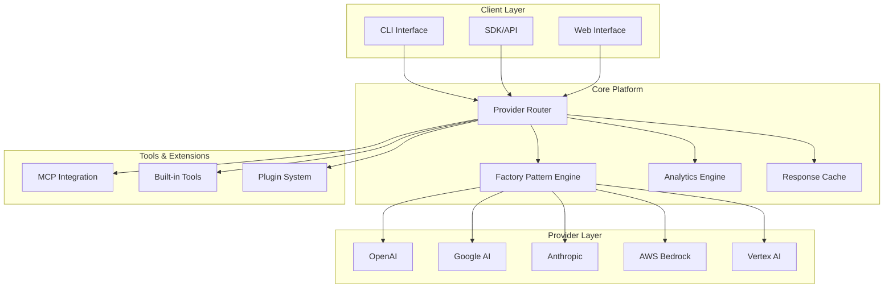
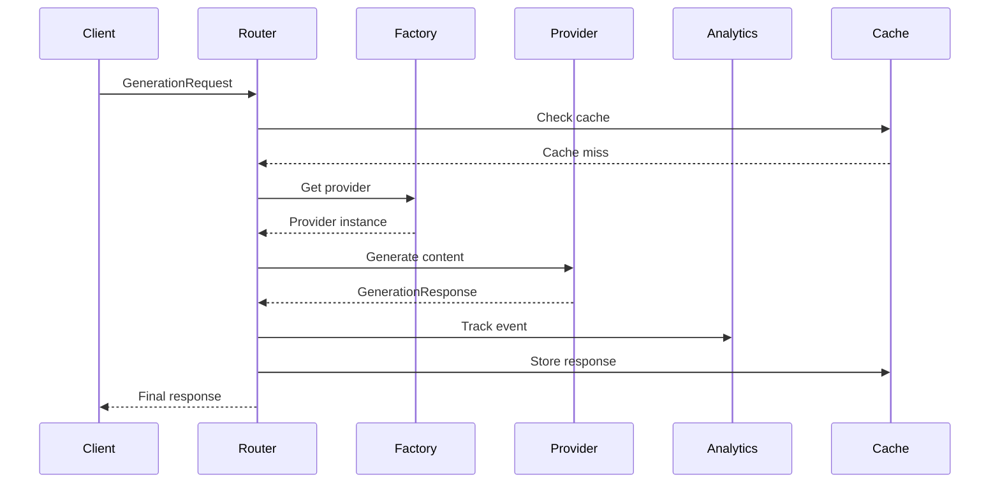

# System Architecture

Technical architecture overview of NeuroLink's enterprise AI platform, including design patterns, scalability considerations, and integration approaches.

## 🏗️ High-Level Architecture

### Core Components



### Architecture Principles

1. **Provider Agnostic**: Universal interface to multiple AI providers
2. **Factory Pattern**: Consistent creation and management of provider instances
3. **Fail-Safe Design**: Automatic fallback and error recovery
4. **Horizontal Scaling**: Stateless design for cloud deployment
5. **Observability**: Comprehensive monitoring and analytics
6. **Extensibility**: Plugin architecture for custom functionality

## 🔧 Core Platform Design

### Provider Router

**Responsibility**: Intelligent request routing and load balancing

```typescript
interface ProviderRouter {
  // Route request to optimal provider
  route(request: GenerationRequest): Promise<Provider>;

  // Health monitoring
  checkHealth(): Promise<ProviderHealth[]>;

  // Load balancing
  selectProvider(criteria: SelectionCriteria): Provider;

  // Failover handling
  handleFailover(
    failedProvider: Provider,
    request: GenerationRequest,
  ): Promise<Provider>;
}

class ProviderRouterImpl implements ProviderRouter {
  private providers: Map<string, Provider>;
  private healthMonitor: HealthMonitor;
  private loadBalancer: LoadBalancer;

  async route(request: GenerationRequest): Promise<Provider> {
    // 1. Check provider preferences
    // 2. Evaluate health status
    // 3. Apply load balancing
    // 4. Select optimal provider
    return this.loadBalancer.select(this.getHealthyProviders(), request);
  }
}
```

### Factory Pattern Engine

**Responsibility**: Consistent provider instance creation and lifecycle management

```typescript
interface ProviderFactory {
  createProvider(type: ProviderType, config: ProviderConfig): Provider;
  getProvider(type: ProviderType): Provider;
  configureProvider(type: ProviderType, config: ProviderConfig): void;
  destroyProvider(type: ProviderType): void;
}

class UniversalProviderFactory implements ProviderFactory {
  private providerInstances: Map<ProviderType, Provider> = new Map();
  private configurations: Map<ProviderType, ProviderConfig> = new Map();

  createProvider(type: ProviderType, config: ProviderConfig): Provider {
    switch (type) {
      case "openai":
        return new OpenAIProvider(config);
      case "google-ai":
        return new GoogleAIProvider(config);
      case "anthropic":
        return new AnthropicProvider(config);
      // ... other providers
    }
  }

  getProvider(type: ProviderType): Provider {
    if (!this.providerInstances.has(type)) {
      const config = this.configurations.get(type);
      const provider = this.createProvider(type, config);
      this.providerInstances.set(type, provider);
    }
    return this.providerInstances.get(type);
  }
}
```

### Analytics Engine

**Responsibility**: Usage tracking, performance monitoring, and insights generation

```typescript
interface AnalyticsEngine {
  track(event: AnalyticsEvent): Promise<void>;
  query(criteria: QueryCriteria): Promise<AnalyticsResult>;
  generateReport(type: ReportType, timeRange: TimeRange): Promise<Report>;
  getMetrics(metricNames: string[]): Promise<MetricValue[]>;
}

class AnalyticsEngineImpl implements AnalyticsEngine {
  private storage: AnalyticsStorage;
  private aggregator: MetricsAggregator;
  private reporter: ReportGenerator;

  async track(event: AnalyticsEvent): Promise<void> {
    // 1. Validate event data
    // 2. Enrich with metadata
    // 3. Store in time-series database
    // 4. Update real-time aggregates
    await this.storage.store(event);
    await this.aggregator.update(event);
  }
}
```

## 🔀 Provider Integration Architecture

### Universal Provider Interface

```typescript
interface Provider {
  readonly name: string;
  readonly type: ProviderType;
  readonly capabilities: ProviderCapabilities;

  // Core functionality
  generate(request: GenerationRequest): Promise<GenerationResponse>;
  stream(request: StreamRequest): AsyncIterable<StreamChunk>;

  // Health and monitoring
  checkHealth(): Promise<HealthStatus>;
  getMetrics(): Promise<ProviderMetrics>;

  // Configuration
  configure(config: ProviderConfig): void;
  validateConfig(config: ProviderConfig): ValidationResult;
}

abstract class BaseProvider implements Provider {
  protected config: ProviderConfig;
  protected httpClient: HttpClient;
  protected rateLimiter: RateLimiter;
  protected retryManager: RetryManager;

  constructor(config: ProviderConfig) {
    this.config = config;
    this.httpClient = new HttpClient(config.httpConfig);
    this.rateLimiter = new RateLimiter(config.rateLimit);
    this.retryManager = new RetryManager(config.retryConfig);
  }

  abstract generate(request: GenerationRequest): Promise<GenerationResponse>;

  protected async makeRequest<T>(
    requestData: any,
    transformer: (response: any) => T,
  ): Promise<T> {
    // 1. Apply rate limiting
    await this.rateLimiter.acquire();

    // 2. Make HTTP request with retries
    const response = await this.retryManager.execute(() =>
      this.httpClient.post(this.getEndpoint(), requestData),
    );

    // 3. Transform response
    return transformer(response.data);
  }

  protected abstract getEndpoint(): string;
}
```

### Provider-Specific Implementations

```typescript
class OpenAIProvider extends BaseProvider {
  async generate(request: GenerationRequest): Promise<GenerationResponse> {
    const openaiRequest = this.transformRequest(request);

    return this.makeRequest(openaiRequest, (response) => ({
      content: response.choices[0].message.content,
      provider: "openai",
      model: response.model,
      usage: {
        promptTokens: response.usage.prompt_tokens,
        completionTokens: response.usage.completion_tokens,
        totalTokens: response.usage.total_tokens,
      },
      metadata: {
        finishReason: response.choices[0].finish_reason,
        logprobs: response.choices[0].logprobs,
      },
    }));
  }

  private transformRequest(request: GenerationRequest): any {
    return {
      model: request.model || this.config.defaultModel,
      messages: [{ role: "user", content: request.input.text }],
      temperature: request.temperature || 0.7,
      max_tokens: request.maxTokens || 1000,
      stream: false,
    };
  }

  protected getEndpoint(): string {
    return "https://api.openai.com/v1/chat/completions";
  }
}

class GoogleAIProvider extends BaseProvider {
  async generate(request: GenerationRequest): Promise<GenerationResponse> {
    const googleRequest = this.transformRequest(request);

    return this.makeRequest(googleRequest, (response) => ({
      content: response.candidates[0].content.parts[0].text,
      provider: "google-ai",
      model: response.model,
      usage: {
        promptTokens: response.usageMetadata.promptTokenCount,
        completionTokens: response.usageMetadata.candidatesTokenCount,
        totalTokens: response.usageMetadata.totalTokenCount,
      },
      metadata: {
        finishReason: response.candidates[0].finishReason,
        safetyRatings: response.candidates[0].safetyRatings,
      },
    }));
  }

  private transformRequest(request: GenerationRequest): any {
    return {
      contents: [
        {
          parts: [{ text: request.input.text }],
        },
      ],
      generationConfig: {
        temperature: request.temperature || 0.7,
        maxOutputTokens: request.maxTokens || 1000,
      },
    };
  }

  protected getEndpoint(): string {
    const model = this.config.defaultModel || "gemini-2.5-pro";
    return `https://generativelanguage.googleapis.com/v1beta/models/${model}:generateContent`;
  }
}
```

## 🔧 MCP (Model Context Protocol) Integration

### MCP Architecture

```typescript
interface MCPServer {
  readonly name: string;
  readonly capabilities: MCPCapabilities;

  connect(): Promise<void>;
  disconnect(): Promise<void>;
  listTools(): Promise<MCPTool[]>;
  executeTool(toolName: string, parameters: any): Promise<MCPResult>;
}

class MCPRegistry {
  private servers: Map<string, MCPServer> = new Map();
  private discoveryService: MCPDiscoveryService;

  constructor() {
    this.discoveryService = new MCPDiscoveryService();
  }

  async discoverServers(): Promise<MCPServer[]> {
    // Discover MCP servers from various sources
    const configs = await this.discoveryService.findConfigurations();

    const servers = await Promise.all(
      configs.map((config) => this.createServer(config)),
    );

    return servers.filter((server) => server !== null);
  }

  private async createServer(config: MCPConfig): Promise<MCPServer | null> {
    try {
      const server = new MCPServerImpl(config);
      await server.connect();
      this.servers.set(config.name, server);
      return server;
    } catch (error) {
      console.warn(`Failed to connect to MCP server ${config.name}:`, error);
      return null;
    }
  }
}

class MCPToolIntegration {
  private registry: MCPRegistry;

  constructor(registry: MCPRegistry) {
    this.registry = registry;
  }

  async getAvailableTools(): Promise<ToolDescription[]> {
    const servers = Array.from(this.registry.servers.values());
    const toolLists = await Promise.all(
      servers.map((server) => server.listTools()),
    );

    return toolLists.flat().map((tool) => ({
      name: tool.name,
      description: tool.description,
      parameters: tool.inputSchema,
      server: tool.serverName,
    }));
  }

  async executeTool(toolName: string, parameters: any): Promise<any> {
    const server = this.findServerForTool(toolName);
    if (!server) {
      throw new Error(`Tool ${toolName} not found`);
    }

    return await server.executeTool(toolName, parameters);
  }
}
```

## 📊 Data Flow Architecture

### Request Processing Pipeline



### Analytics Data Pipeline

```typescript
interface AnalyticsDataPipeline {
  ingest(event: AnalyticsEvent): Promise<void>;
  process(batch: AnalyticsEvent[]): Promise<ProcessedEvent[]>;
  store(events: ProcessedEvent[]): Promise<void>;
  aggregate(timeWindow: TimeWindow): Promise<AggregatedMetrics>;
}

class StreamingAnalyticsPipeline implements AnalyticsDataPipeline {
  private ingestionQueue: Queue<AnalyticsEvent>;
  private processor: EventProcessor;
  private storage: TimeSeriesStorage;
  private aggregator: RealTimeAggregator;

  async ingest(event: AnalyticsEvent): Promise<void> {
    // Add to queue for async processing
    await this.ingestionQueue.enqueue(event);
  }

  async process(batch: AnalyticsEvent[]): Promise<ProcessedEvent[]> {
    return await Promise.all(
      batch.map((event) => this.processor.enrich(event)),
    );
  }

  async store(events: ProcessedEvent[]): Promise<void> {
    // Store in time-series database
    await this.storage.batchInsert(events);

    // Update real-time aggregates
    await this.aggregator.update(events);
  }
}
```

## 🚀 Scalability & Performance

### Horizontal Scaling Design

```typescript
interface ScalabilityManager {
  // Auto-scaling based on load
  scaleUp(metrics: LoadMetrics): Promise<void>;
  scaleDown(metrics: LoadMetrics): Promise<void>;

  // Load distribution
  distributeLoad(requests: GenerationRequest[]): Promise<ProviderAssignment[]>;

  // Resource monitoring
  getResourceUtilization(): Promise<ResourceMetrics>;
}

class CloudScalabilityManager implements ScalabilityManager {
  private loadBalancer: LoadBalancer;
  private resourceMonitor: ResourceMonitor;
  private autoScaler: AutoScaler;

  async scaleUp(metrics: LoadMetrics): Promise<void> {
    if (metrics.avgResponseTime > this.config.maxResponseTime) {
      // Scale up provider instances
      await this.autoScaler.increaseCapacity({
        providers: metrics.bottleneckProviders,
        factor: 1.5,
      });
    }
  }

  async distributeLoad(
    requests: GenerationRequest[],
  ): Promise<ProviderAssignment[]> {
    // Intelligent load distribution based on:
    // 1. Provider capacity
    // 2. Request complexity
    // 3. Historical performance
    // 4. Cost optimization

    return this.loadBalancer.distribute(requests, {
      strategy: "least_loaded",
      considerCost: true,
      qualityThreshold: 0.8,
    });
  }
}
```

### Caching Strategy

```typescript
interface CacheStrategy {
  get(key: string): Promise<CacheEntry | null>;
  set(key: string, value: any, ttl?: number): Promise<void>;
  invalidate(pattern: string): Promise<void>;
  getStats(): Promise<CacheStats>;
}

class MultiLevelCache implements CacheStrategy {
  private l1Cache: MemoryCache; // Fast, small capacity
  private l2Cache: RedisCache; // Medium speed, larger capacity
  private l3Cache: DatabaseCache; // Slow, unlimited capacity

  async get(key: string): Promise<CacheEntry | null> {
    // L1 cache check
    let entry = await this.l1Cache.get(key);
    if (entry) {
      return entry;
    }

    // L2 cache check
    entry = await this.l2Cache.get(key);
    if (entry) {
      // Promote to L1
      await this.l1Cache.set(key, entry.value, entry.ttl);
      return entry;
    }

    // L3 cache check
    entry = await this.l3Cache.get(key);
    if (entry) {
      // Promote to L2 and L1
      await this.l2Cache.set(key, entry.value, entry.ttl);
      await this.l1Cache.set(key, entry.value, Math.min(entry.ttl, 300));
      return entry;
    }

    return null;
  }
}
```

## 🔐 Security Architecture

### Authentication & Authorization

```typescript
interface SecurityManager {
  authenticate(credentials: Credentials): Promise<AuthResult>;
  authorize(user: User, resource: Resource, action: Action): Promise<boolean>;
  encrypt(data: any): Promise<EncryptedData>;
  decrypt(encryptedData: EncryptedData): Promise<any>;
}

class EnterpriseSecurityManager implements SecurityManager {
  private authProvider: AuthenticationProvider;
  private authzProvider: AuthorizationProvider;
  private encryptionService: EncryptionService;
  private auditLogger: AuditLogger;

  async authenticate(credentials: Credentials): Promise<AuthResult> {
    const result = await this.authProvider.authenticate(credentials);

    // Log authentication attempt
    await this.auditLogger.log({
      action: "authentication",
      user: credentials.username,
      success: result.success,
      timestamp: new Date(),
      ip: credentials.clientIP,
    });

    return result;
  }

  async authorize(
    user: User,
    resource: Resource,
    action: Action,
  ): Promise<boolean> {
    const authorized = await this.authzProvider.check(user, resource, action);

    // Log authorization decision
    await this.auditLogger.log({
      action: "authorization",
      user: user.id,
      resource: resource.id,
      requestedAction: action,
      granted: authorized,
      timestamp: new Date(),
    });

    return authorized;
  }
}
```

### API Key Management

```typescript
interface APIKeyManager {
  createKey(scope: KeyScope, permissions: Permission[]): Promise<APIKey>;
  validateKey(keyValue: string): Promise<KeyValidationResult>;
  revokeKey(keyId: string): Promise<void>;
  rotateKey(keyId: string): Promise<APIKey>;
}

class SecureAPIKeyManager implements APIKeyManager {
  private storage: SecureStorage;
  private encryptor: KeyEncryptor;
  private rateLimiter: APIRateLimiter;

  async createKey(scope: KeyScope, permissions: Permission[]): Promise<APIKey> {
    const keyValue = this.generateSecureKey();
    const encryptedKey = await this.encryptor.encrypt(keyValue);

    const apiKey: APIKey = {
      id: generateUUID(),
      hashedValue: await this.hashKey(keyValue),
      encryptedValue: encryptedKey,
      scope,
      permissions,
      createdAt: new Date(),
      expiresAt: this.calculateExpiry(scope),
      isActive: true,
    };

    await this.storage.store(apiKey);

    return {
      ...apiKey,
      plainValue: keyValue, // Only returned once
    };
  }
}
```

## 📈 Monitoring & Observability

### Metrics Collection

```typescript
interface MetricsCollector {
  recordMetric(name: string, value: number, tags?: Tags): void;
  recordTiming(name: string, duration: number, tags?: Tags): void;
  recordCounter(name: string, increment?: number, tags?: Tags): void;
  recordGauge(name: string, value: number, tags?: Tags): void;
}

class PrometheusMetricsCollector implements MetricsCollector {
  private registry: Registry;
  private counters: Map<string, Counter> = new Map();
  private histograms: Map<string, Histogram> = new Map();
  private gauges: Map<string, Gauge> = new Map();

  recordTiming(name: string, duration: number, tags?: Tags): void {
    if (!this.histograms.has(name)) {
      this.histograms.set(
        name,
        new Histogram({
          name: name,
          help: `${name} timing histogram`,
          labelNames: Object.keys(tags || {}),
          registers: [this.registry],
        }),
      );
    }

    const histogram = this.histograms.get(name)!;
    histogram.observe(tags || {}, duration);
  }
}
```

### Health Monitoring

```typescript
interface HealthMonitor {
  checkSystemHealth(): Promise<HealthStatus>;
  checkProviderHealth(provider: string): Promise<ProviderHealth>;
  getHealthHistory(timeRange: TimeRange): Promise<HealthHistoryEntry[]>;
  registerHealthCheck(name: string, check: HealthCheck): void;
}

class ComprehensiveHealthMonitor implements HealthMonitor {
  private healthChecks: Map<string, HealthCheck> = new Map();
  private storage: HealthStorage;

  async checkSystemHealth(): Promise<HealthStatus> {
    const checks = Array.from(this.healthChecks.entries());
    const results = await Promise.allSettled(
      checks.map(([name, check]) => this.executeHealthCheck(name, check)),
    );

    const overallStatus = this.calculateOverallStatus(results);

    await this.storage.store({
      timestamp: new Date(),
      status: overallStatus,
      checks: results.map((result, index) => ({
        name: checks[index][0],
        status: result.status === "fulfilled" ? result.value : "failed",
        error: result.status === "rejected" ? result.reason : null,
      })),
    });

    return overallStatus;
  }
}
```

This architecture provides a robust, scalable foundation for NeuroLink's enterprise AI platform, ensuring reliability, performance, and security at scale.

## 📚 Related Documentation

- [Factory Patterns](../advanced/factory-patterns.md) - Implementation patterns
- [Development Guide](contributing.md) - Development setup
- [Testing Strategy](testing.md) - Quality assurance
- [Performance Optimization](../advanced/analytics.md) - Monitoring and optimization
