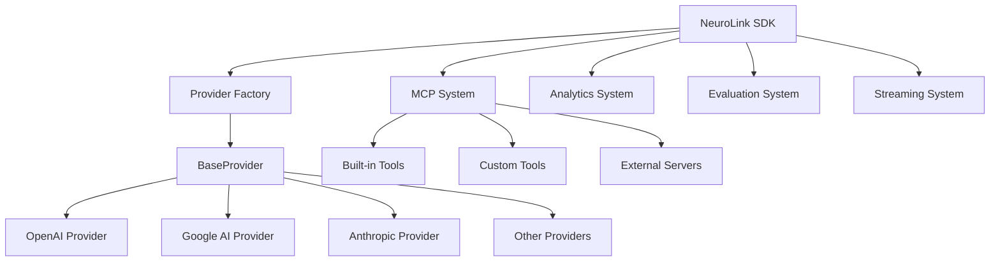

# Development

Contributing to NeuroLink and extending its capabilities for your specific needs.

## 🎯 Development Hub

This section covers everything needed for contributing to NeuroLink, understanding its architecture, and extending its functionality.

<div class="grid cards" markdown>

- :material-heart: **[Contributing](contributing.md)**

  ***

  How to contribute to NeuroLink, including setup, coding standards, and submission guidelines.

- :material-test-tube: **[Testing](testing.md)**

  ***

  Comprehensive testing strategies, test suite organization, and validation procedures.

- :material-sitemap: **[Architecture](architecture.md)**

  ***

  Deep dive into NeuroLink's architecture, design patterns, and system organization.

- :material-factory: **[Factory Pattern Migration](factory-migration.md)**

  ***

  Guide for upgrading from older architectures to the new unified factory pattern system.

- :material-package-variant: **[Package Overrides](package-overrides.md)**

  ***

  Documentation for package version overrides, security vulnerabilities, and maintenance procedures.

</div>

## 🚀 Quick Development Setup

=== "Full Setup"

    ```bash
    # Clone the repository
    git clone https://github.com/juspay/neurolink
    cd neurolink

    # Install dependencies
    pnpm install

    # Setup git hooks for build rule enforcement
    npx husky install

    # Complete automated setup
    pnpm setup:complete

    # Run comprehensive tests
    pnpm test:adaptive

    # Build the project with validation
    pnpm build:complete

    # Validate build rules and quality
    pnpm run validate:all
    ```

=== "Minimal Setup"

    ```bash
    # Basic development environment
    pnpm install
    pnpm env:setup

    # Start development
    pnpm dev

    # Run quick tests
    pnpm test:smart
    ```

=== "Documentation Only"

    ```bash
    # Install docs dependencies
    pip install -r requirements.txt

    # Serve documentation locally
    mkdocs serve

    # Build documentation
    mkdocs build
    ```

## 🏗️ Architecture Overview

NeuroLink uses a **Factory Pattern** architecture that provides:

### Core Components



### Design Principles

- **Unified Interface**: All providers implement the same `AIProvider` interface
- **Type Safety**: Full TypeScript support with strict typing
- **Extensibility**: Easy to add new providers and tools
- **Performance**: Optimized for production use
- **Reliability**: Comprehensive error handling and fallbacks

## 🔧 Development Features

### Enterprise Automation (72+ Commands)

NeuroLink includes comprehensive automation for development:

```bash
# Environment & Setup
pnpm setup:complete        # Complete project setup
pnpm env:setup             # Environment configuration
pnpm env:validate          # Configuration validation

# Testing & Quality
pnpm test:adaptive         # Intelligent test selection
pnpm test:providers        # AI provider validation
pnpm quality:check         # Full quality pipeline

# Content Generation
pnpm content:screenshots   # Automated screenshot capture
pnpm content:videos        # Video generation
pnpm docs:sync            # Documentation synchronization

# Build & Deployment
pnpm build:complete        # 7-phase enterprise pipeline
pnpm dev:health           # System health monitoring
```

### Smart Testing System

- **Adaptive test selection** based on code changes
- **Provider validation** across all AI services
- **Performance benchmarking** and regression detection
- **Comprehensive coverage** reporting

### Automated Content Generation

- **Screenshot automation** for documentation
- **Video generation** for demonstrations
- **Documentation synchronization** across files
- **Asset optimization** and management

## 🧪 Testing Philosophy

NeuroLink uses a multi-layered testing approach:

### Test Categories

1. **Unit Tests** - Individual component testing
2. **Integration Tests** - Provider and tool interaction
3. **End-to-End Tests** - Complete workflow validation
4. **Performance Tests** - Speed and resource usage
5. **Regression Tests** - Prevent breaking changes

### Test Organization

```
test/
├── unit/              # Unit tests
├── integration/       # Integration tests
├── e2e/              # End-to-end tests
├── performance/      # Performance benchmarks
├── fixtures/         # Test data and mocks
└── utils/            # Testing utilities
```

### Running Tests

```bash
# Smart test runner (recommended)
pnpm test:adaptive

# Full test suite
pnpm test:run

# Specific test categories
pnpm test:unit
pnpm test:integration
pnpm test:e2e

# With coverage
pnpm test:coverage
```

## 🎨 Code Style & Standards

### TypeScript Configuration

- **Strict mode** enabled for maximum type safety
- **Path mapping** for clean imports
- **ESLint** and **Prettier** for consistent formatting
- **Documentation comments** for all public APIs

### Naming Conventions

- **PascalCase** for classes and interfaces
- **camelCase** for functions and variables
- **kebab-case** for file names
- **UPPER_CASE** for constants

### File Organization

```
src/
├── cli/              # Command-line interface
├── lib/              # Core library
│   ├── core/         # Core functionality
│   ├── providers/    # AI provider implementations
│   ├── mcp/          # MCP tool system
│   ├── types/        # TypeScript definitions
│   └── utils/        # Utility functions
├── test/             # Test files
└── tools/            # Development tools
```

## 🔄 Contribution Workflow

### 1. Setup Development Environment

```bash
# Fork and clone
git clone https://github.com/YOUR_USERNAME/neurolink
cd neurolink
pnpm setup:complete
```

### 2. Create Feature Branch

```bash
# Create semantic branch
git checkout -b feat/your-feature-name
git checkout -b fix/issue-description
git checkout -b docs/documentation-update
```

### 3. Development Process

```bash
# Make changes
pnpm dev                # Start development server
pnpm test:adaptive      # Run relevant tests
pnpm quality:check      # Validate code quality
```

### 4. Commit & Submit

```bash
# Commit with semantic messages
git commit -m "feat: add new provider support"
git commit -m "fix: resolve streaming timeout issue"
git commit -m "docs: update API documentation"

# Push and create PR
git push origin feat/your-feature-name
```

## 📚 Learning Resources

### Architecture Deep Dive

- **[Factory Pattern Guide](factory-migration.md)** - Understanding the core architecture
- **[MCP Integration](../advanced/mcp-integration.md)** - Tool system implementation
- **[Provider Development](../reference/configuration.md)** - Adding new AI providers

### Best Practices

- **Error handling** patterns and strategies
- **Performance optimization** techniques
- **Testing** methodologies and coverage
- **Documentation** standards and automation

### Community

- **GitHub Discussions** for questions and ideas
- **Issue tracking** for bugs and feature requests
- **Code reviews** for learning and improvement
- **Release notes** for staying updated

## 🔗 Related Resources

- **[CLI Guide](../cli/index.md)** - Understanding the command-line interface
- **[SDK Reference](../sdk/index.md)** - API implementation details
- **[Advanced Features](../advanced/index.md)** - Enterprise capabilities
- **[Examples](../examples/index.md)** - Practical implementations
